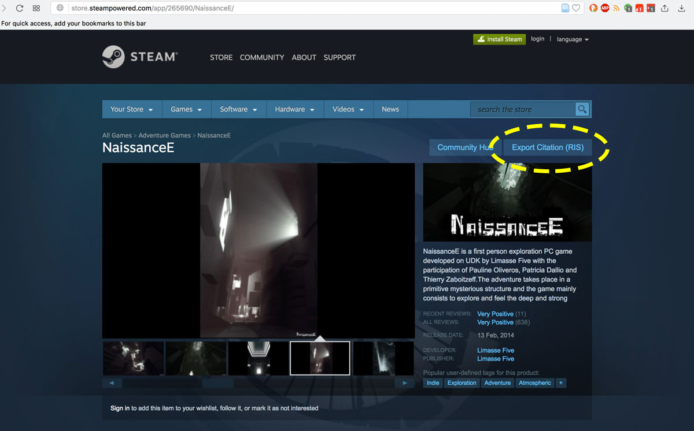
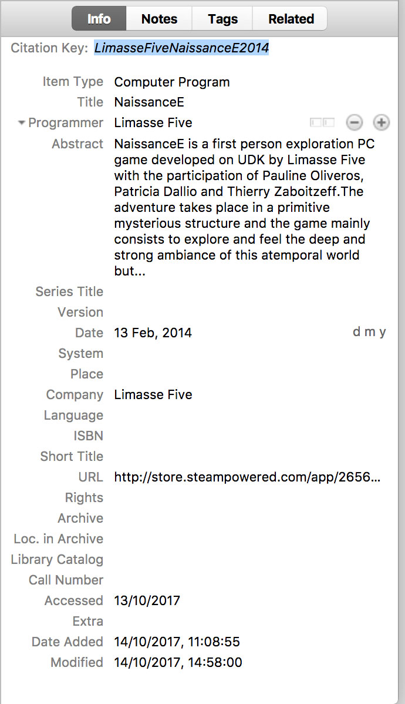
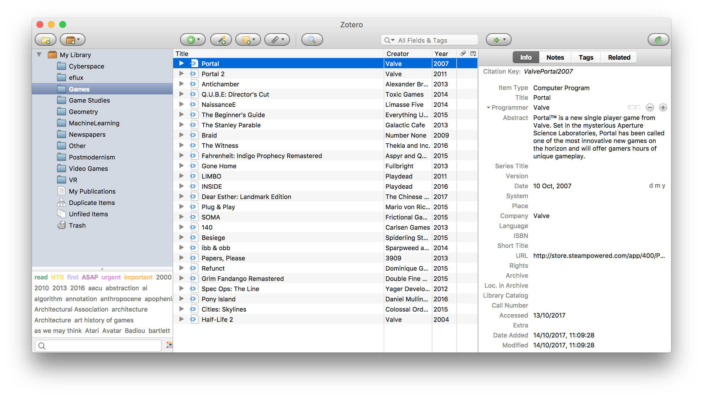

# Ludography / Steam Videogame Citation Info Grabber
Runs a browser script on game websites of Steam, that allows exporting a RIS file (that includes the bibliographical information of the game) in order to help add them in a bibliography catalogue and cite apps and videogames from steampowered.com
Creates a new button next to the "Community hub" button, downloads a RIS file, importable in Bibliography management software.

## Installation instructions: 
  1. Install a user script manager for your browser 
    * Tampermonkey browser plugin - https://tampermonkey.net (supports Chrome, Opera, Safari, Firefox, Microsoft Edge and more) 
    * or Greasemonkey of Firefox - http://www.greasespot.net
  2. Import the script to the plugin
    * [Go directly to the script](steampowered.ris.user.js) and click RAW (at the top right) which should prompt you to install the script or click on the plugin icon on your browser (next to address bar) and then "Add new script". There, copy paste the code from "steampowered.ris" file of this repository.
    
## What it does: 
1. Upon visiting any game on the Steam website, the script will add a button on the top right, labled "EXPORT CITATION (RIS)". 
2. By pressing the button, a RIS file will be downloaded on your computer. 
3. RIS Files are compatible and can be imported in:
  * **Zotero** (recommended - free and open source bibliography management and citation software) https://www.zotero.org
  * **EndNote** (commercial bibliography and citation software by Clarivate Analytics, previously Thomson Reuters) 
  * **Mendeley** (free bibliography and citation software by Elsever) 
  * **Citavi** (commercial PC bibliography management software) 

## What the citation includes: 
  * Entry as "_Computer Program_"
  * Game title as "_Title_" 
  * Developer as "_Programmerer_" & "_Company_" 
  * Publisher (if applicable) as "_Programmer_" 
  * Release Date as "_Date_" 
  * Description as "_Abstract_"
  * Steam URL as "_URL_"
  * Also RIS download date as "_Accessed_" 
  
  
 Steam Game site example, with extra RIS download button
  
 
 Zotero info panel, after importing RIS file
  
  
 Zotero game library view
  
  
## Notice 
* There is no "correct or orthodox" way for citing videogames and very few guidlines are available for that - it is especially tricky when one considers also non digital games. However this might be a first step towards some kind of normalization of game bibliography, or at least the need for videogame bibliography. 
* The actual citation of these games entries is controlled by your Reference Style. Given that for the moment these entries are listed as "Computer Programs".
* Tested in Zotero

## Known issues:
  * Entries are made as "Computer Programs". 
## To-do:
  * Add platforms
